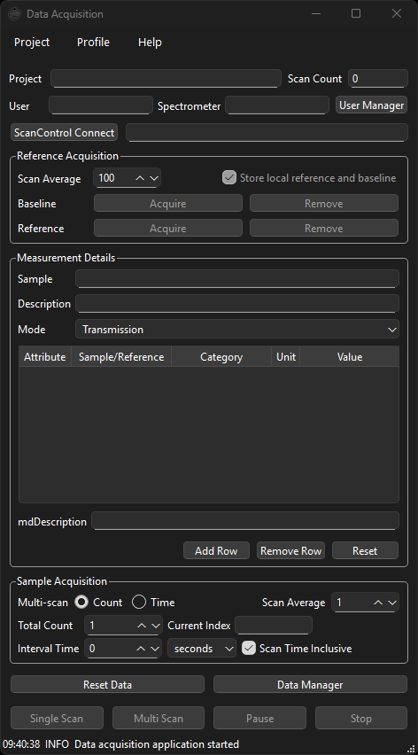
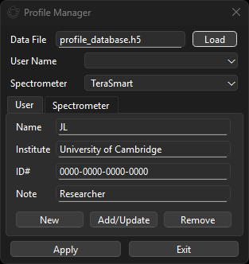
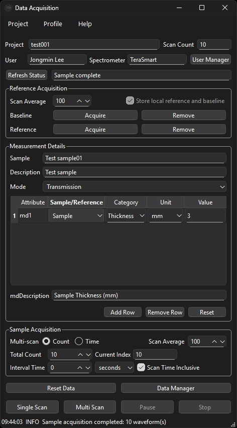
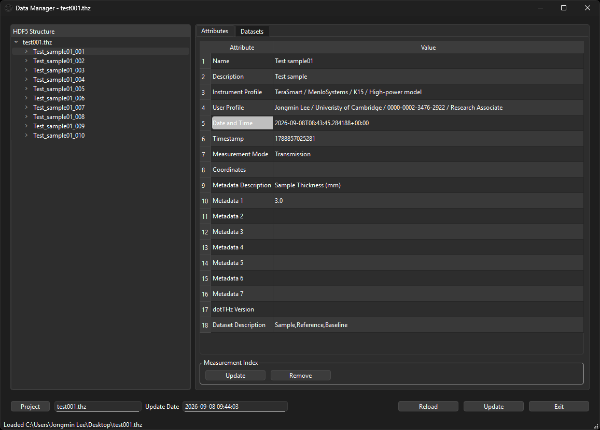
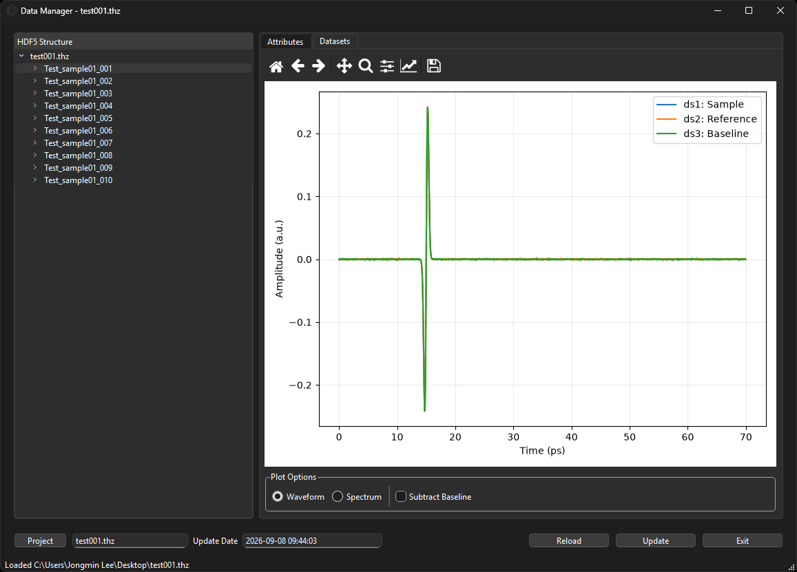

# dotTHz Data Acquisition user manual

## Choose your workflow

Data Acquisition collects THz time-domain waveforms into `.thz` HDF5 projects. The supplied live implementation is Menlo Systems ScanControl. Other commercial or home-built systems require [customisation](CUSTOMISATION.md); adding a spectrometer profile does not add device support.

Data Manager works on compatible existing projects without ScanControl or connected hardware. Follow [the installation guide](../Installation_guide.txt) to install or extract the application.

## Visual guide to the windows

Use **Data Acquisition** to prepare a project and collect waveforms, **Profile Manager** to select the recorded user and instrument, and **Data Manager** to inspect saved measurements. The screenshots show example records and settings, not required instrument settings or evidence of measurement quality. Click an image to view it at full size.

- [Main window](#main-window)
- [Profile Manager](#profile-manager)
- [Worked acquisition example](#worked-acquisition-example)
- [Data Manager: attributes](#data-manager-attributes)
- [Data Manager: datasets](#data-manager-datasets)

### Main window

*Figure 1. Main window before a project and instrument connection are ready.*

| Area, from top to bottom | What you do here |
| --- | --- |
| **Project**, **User**, **Spectrometer** | Check the project and selected profiles. **Scan Count** counts saved measurement groups. **User Manager** opens Profile Manager. |
| **ScanControl Connect** and status field | Connect and check status. After connection, the button reads **Refresh Status**. |
| **Reference Acquisition** | Set calibration **Scan Average**, then acquire or remove the baseline/reference held in session memory. |
| **Measurement Details** | Enter sample name, description, mode, and numeric metadata. **Reset** here clears the metadata table. |
| **Sample Acquisition** | Set sample averaging, count/time termination, and interval timing. **Current Index** counts completed waveforms in the run. |
| Bottom buttons | Start **Single Scan** or **Multi Scan**, **Pause**/**Resume**, or **Stop**. Open **Data Manager** to inspect the file. **Reset Data** deletes project measurements after confirmation. |
| Bottom status bar | Read the latest application message; use **Show Logs** for more detail. |

For a first measurement: create a project, apply profiles, connect to ScanControl, prepare calibration if needed, enter sample details, and click **Single Scan**. Then open **Data Manager**, select the saved measurement, and choose **Datasets**. The following sections explain each step.

## Projects and profiles

1. Choose **Project > New** and a writable `.thz` location, or **Project > Open**. Creating at an existing path replaces the file when overwrite is accepted.
2. Profile Manager opens on creation. Select/add a user and spectrometer and click **Apply**. Reopen it with **Profile > Profile Manager** or **User Manager**. Exiting without Apply leaves the acquisition selection unchanged.
3. In Profile Manager, use **New**, enter details, then **Add/Update** to save the record. **Remove** deletes a record; **Load** selects an existing HDF5 profile database. Database edits happen independently of Apply.
4. Enter **Sample**, **Description**, and **Mode** (Transmission/Reflection). Mode records metadata, not hardware configuration.
5. Use **Add Row** for up to seven numeric metadata values. Select Sample/Reference, a category and unit, and a value. `mdDescription` is generated from these selections. **Remove Row** reduces active rows; **Reset** clears the metadata table.

The default database is `profile_database.h5` beside the app. Selected profile records are copied into project/measurement metadata. Profiles do not contain driver settings. Review their content before sharing a project.

### Profile Manager

*Figure 2. Profile Manager with the User tab open.*

**Data File** identifies the profile database; **Load** opens another database. **User Name** and **Spectrometer** select existing records. The **User** tab edits Name, Institute, ID#, and Note; the **Spectrometer** tab edits model, manufacturer, ID, and note.

To create a record, choose its tab, click **New**, fill the fields, and click **Add/Update**. To change a record, select it first, edit its fields, then click **Add/Update**. Select the desired user and spectrometer in the lists before clicking **Apply** to return them to the acquisition window. **Exit** closes without applying a selection, but does not undo database edits already saved with Add/Update or Remove.

## Connect Menlo ScanControl

Start ScanControl and enable its remote interface at `localhost:8002`, the default. Click **ScanControl Connect**; after connection this becomes **Refresh Status**. Leave ScanControl **Idle** before acquisition. Configure the instrument itself in ScanControl.

There is no GUI host/port editor. Source customisation can configure `MenloScanControlClient(host=..., port=...)` in application construction. See the customisation guide for other systems.

## Capture calibration

Prepare the baseline or reference required by your experiment, set **Scan Average** under **Reference Acquisition**, and click the corresponding **Acquire**. Each captures one averaged waveform.

Baseline/reference are held in session memory and copied into subsequent sample measurements when available. The displayed **Store local reference and baseline** control currently has no effect on this behaviour. Calibration is not saved as a standalone measurement or restored into memory when reopening a project. Create/Open, Reset Data, and application restart clear session calibration. **Remove** beside calibration clears only its in-memory waveform.

Samples can be acquired without calibration. Reacquire calibration after changing scan window, time grid, or amplitude scaling. The application does not automatically align axes.

## Acquire samples

- Set **Scan Average** under **Sample Acquisition**. **Single Scan** captures one averaged sample.
- For **Multi Scan**, choose **Count** and **Total Count**, or **Time** and **Total Time** with its unit.
- **Interval Time** adds a wait after each measurement. **Scan Time Inclusive** instead targets spacing between measurement starts, with no extra wait when a scan takes longer.
- **Pause** becomes **Resume**. In the supplied backend it delays collection/reset progression and does not send a hardware pause. Time mode includes pauses and waits and may finish after the requested duration while a wait or measurement completes.
- **Stop** requests termination and cleanup. Already stored measurements remain. Current Index counts completed waveforms in the run; Scan Count shows project measurement groups. Time Left is an estimate.

Wait for acquisition to finish or stop before switching projects, copying files, or editing/removing measurements. Calibration used by a run is a snapshot taken at its start.

### Worked acquisition example

*Figure 3. Populated main window after a ten-measurement run.*

To follow the illustrated workflow with your own experiment:

1. Create a project and apply your profiles. The example project is `test001`.
2. Connect to ScanControl and leave it Idle. Prepare and acquire suitable baseline/reference waveforms if needed; the example calibration averaging control shows **100**.
3. Enter sample details. The example uses `Test sample01`, description `Test sample`, and **Transmission**.
4. Click **Add Row**, choose **Sample**, **Thickness**, and **mm**, then enter your value. Here `md1` is **3** and **mdDescription** becomes `Sample Thickness (mm)`. This records metadata; it does not configure the instrument.
5. Under **Sample Acquisition**, choose **Count**, **Total Count** of **10**, **Scan Average** of **1**, and **Interval Time** of **0 seconds**. Click **Multi Scan** when ready.
6. On completion, **Current Index** is **10** and status reports **Sample complete**. In this initially empty project, **Scan Count** is also **10**; with earlier measurements it would be higher.
7. Open **Data Manager** and select a measurement to inspect its attributes or datasets, as shown below.

Calibration and sample averaging are independent. These values explain the screen; choose averaging and timing appropriate to your experiment.

## Saving and inspecting data

Each completed sample is written immediately. **Project > Save** saves current sample name, description, and mode as project metadata; profiles are saved on Apply. Save does not persist every control setting or session calibration. **Save As** copies the on-disk file and switches to that copy; use Save first to include recently edited project fields.

Open **Data Manager** and select a measurement in the HDF5 tree. Use its **Attributes** and **Datasets** tabs as described below.

**Reload** rereads the project; commit pending edits first. **Remove** deletes a measurement after confirmation. In the acquisition window, **Reset Data** deletes all measurements and clears saved project metadata and session calibration after confirmation. There is no undo; preserve a separate copy when needed. See [DATA_FORMAT.md](DATA_FORMAT.md) for storage behaviour and compatibility limits.

### Data Manager: attributes

*Figure 4. Saved details for the first measurement in the example project.*

The **HDF5 Structure** tree contains the project and its measurement groups. Select a group such as `Test_sample01_001` to inspect it; expand its arrow to see its datasets. In **Attributes**, select a measurement group to edit enabled value cells.

Here **Name** and **Description** come from Measurement Details, and **Instrument Profile** and **User Profile** come from the applied profiles. **Metadata Description** is `Sample Thickness (mm)` and **Metadata 1** is `3.0`, carrying the main window's metadata row into the saved measurement. Blank rows indicate attributes absent from this example file.

Save edits with **Update inside the Measurement Index box**, directly below the table. The separate **Update** button in the bottom row currently has no connected action. **Remove** in Measurement Index deletes the selected measurement after confirmation.

Use **Project** at the bottom left to open a compatible `.thz` file, including without hardware. **Reload** rereads the current file; commit pending edits first. **Update Date** shows file modification time, while **Date and Time** in the attributes describes the selected capture. **Exit** closes Data Manager.

### Data Manager: datasets

*Figure 5. Waveform view of the selected measurement. Traces can overlap; the legend identifies available datasets.*

1. Select a measurement and open **Datasets**. Selecting a dataset child also plots its parent measurement's datasets together.
2. Choose **Waveform** for amplitude versus time. Here the legend shows `ds1: Sample`, `ds2: Reference`, and `ds3: Baseline`. Reference and baseline appear only when stored with the measurement.
3. Use the plot toolbar to pan, zoom, return to the home view, or save a plot image. Saving an image does not export or change the waveform arrays.
4. Choose **Spectrum** to view FFT magnitude and adjust its frequency range. Time is in **ps**, amplitude in arbitrary units, and frequency in **THz**. Spectrum is not transmission, absorbance, or a fitted material property.
5. Enable **Subtract Baseline** to subtract the stored baseline from displayed sample/reference when axes match. This changes only the plot, leaving stored data intact.

See the [stored data layout](DATA_FORMAT.md) for dataset shapes and compatibility limits.

## Logs, About, and troubleshooting

**Show Logs** displays connection/acquisition diagnostics. **Dump Logs** clears `data_acquisition.log` beside the app; retain needed diagnostics first. **Help > About Data Acquisition** shows dotTHz identity, supplied hardware support, documentation paths, and release information.

| Symptom | What to check |
| --- | --- |
| Cannot connect | Start ScanControl; check its remote interface, host/port, and Show Logs. |
| Device must be Idle | Stop an existing scan in ScanControl, Refresh Status, and retry. |
| Acquisition controls disabled | Connect successfully; create/open a project before acquiring. |
| Calibration disappeared | Reacquire after creating/reopening a project; it is session memory. |
| Cannot subtract baseline | Use calibration with the same sample time axis and settings. |
| Empty or misleading spectrum | Check time units (ps), at least two samples, uniform increasing spacing, and frequency range. |
| Cannot save or edit profiles | Use writable directories; avoid another process writing the same HDF5 file. |
| Startup/import failure | Use the environment where requirements were installed and Python 3.9 or newer. |
| No plot area | Install requirements including Matplotlib and restart. |

Report issues in the hosting dotTHz repository with About version/build, OS, backend/hardware, reproduction steps, and a relevant log excerpt. For data issues, include a small shareable file and identify hardware versus synthetic data.
